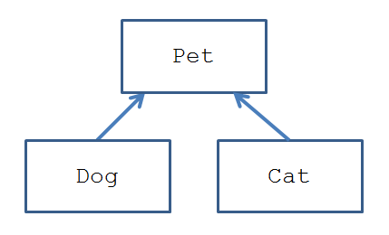
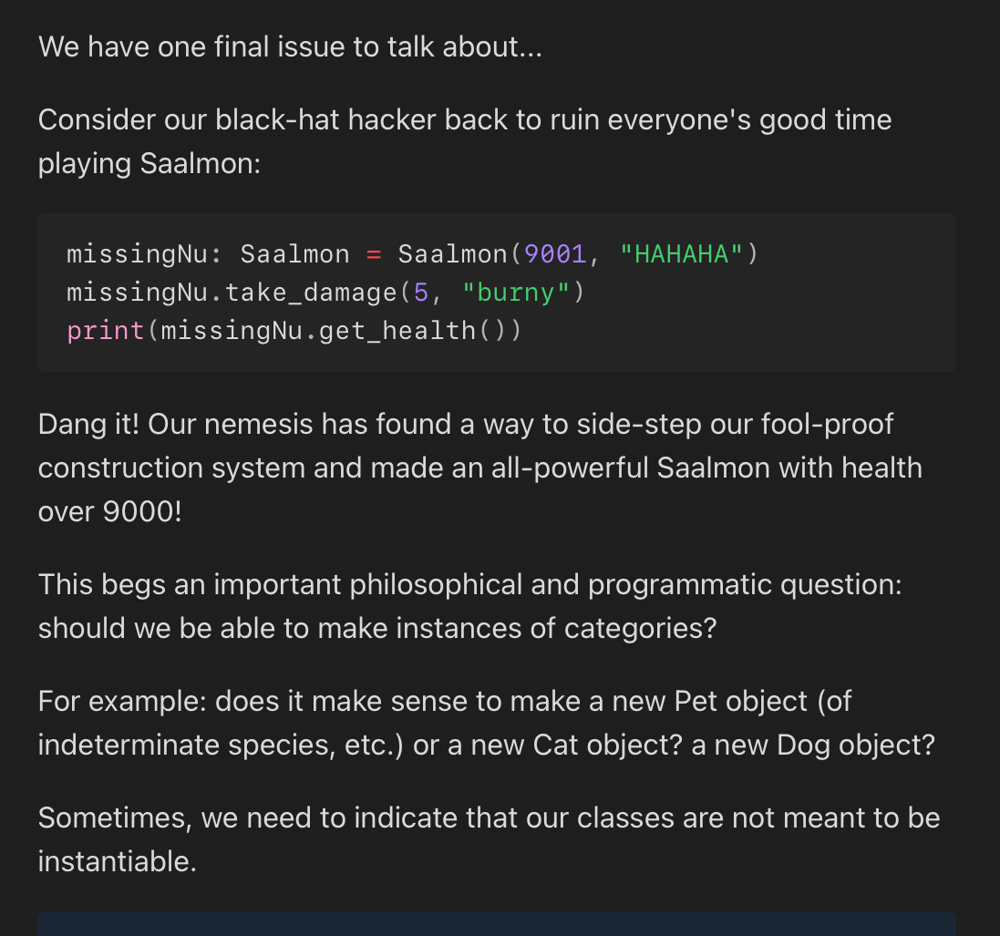

# Review
===============
    - Classes + Object Oriented Programming
    Motivating Example
    -Saalman -> Mythical Fighting Pets
        - Burnymon -> fire-type
        - Dampymon -> water-type

-In Python, adding a single underscore before a variable name is a convention to indicate that the variable is intended for internal use within a module or class. It signals to other developers that the variable should not be accessed or modified directly from outside the module or class. However, it's important to note that this is just a naming convention and doesn't enforce any access restrictions; Python doesn't have true private variables. 

# Getters:
===============
Get information for use outside the class


**!!Inheritance!!**:
======================
To review: Our goal is to specify the "general" properties and behaviors of some classes in one place, and then specify exceptions to those generalities elsewhere.
** In programming, ***inheritance*** describes the mechanisms by which one class can obtain the properties and behaviors of another.

In Python, we define ***superclasses*** that contain "general" or "default" properties and methoids, and ***subclasses*** that inherit those generalities while specifying any exceptions to them.
    - a subclass is said to inherit all of the properties and methods defined in the extended superclass, thus gaining their definitions
        - ``ex: For example, if we're designing classes to represent household Pets, then we can pet() any Pet (the general), whereas Dogs (which are Pets) will bark when they speak() and Cats (also Pets) will meow.``
        

**Inheritance Syntactic Overview**
=======================================
Presuming we have a class `SuperClass` whose characteristics we want to inherit into a new class `SubClass`:
```python
    class Subclass(SuperClass)
```

If a field or method has the same name or signature in both `SubClass` and `Superclass` (called an ***overloaded*** method), then a SubClass object will use the Subclass's definition, and a SuperClass object will use the SuperClass's definition

```python
class Pet:

    def speak(self):
        print("*silence*")

class Dog(Pet):

    def speak(self):
        print("Woof!")
class Cat(Pet):
    # ....nothing here!

p: Pet = Pet()
d: Dog = Dog()
c: Cat = Cat()

p.speak()
d.speak()
c.speak()
```
`The prefixes p:, d:, and c: in your code indicate type hints in Python. These hints specify the expected type of the variable.`
`p: Pet means that p is expected to be of type Pet, and it's assigned an instance of Pet().`
`d: Dog means d is expected to be of type Dog, and it's assigned an instance of Dog().`
`c: Cat means c is expected to be of type Cat, and it's assigned an instance of Cat().`

For the Dog class, when we call .speak(), it'll print "Woof"! For Cat, since we didn't implement a speak method, it'll inherit from Pet, and print "*silence*".
This example demonstrates how we can define default behaviors in a superclass and then override those when necessary in a subclass (as we'll see in a moment).

**The super() Keyword**
==============================
`the super() keyword provides a reference to a superclass from within the subclass`

To call a superclass's constructor from within a subclass we simply use the syntax:
```python
super().__init__(arg1, arg2, ...)
```
The super() keyword may also be used to access the superclass' methods explicitly by the syntax super().superClassMethod(...)
```python
super().superClassMethod(...)
```
    This is useful if we want to use behaviors of methods in a superclass (from inside the subclass) that share a name with a method in the subclass (and so we can use the super keyword to distinguish which version of the method we're invoking)

**Abstract Base Classes**
=========================

Sometimes, we need to indicate that our classes are not meant to be instantiable:
    `Instantiated means creating an object from a class.`
In Python, we indicate that objects of a certain class cannot be constructed by having that class inherit another Python class: ***Abstract Base Classes***
    -This means:
    Some classes should not be used to make objects directly.
    Instead, they should only serve as blueprints for other classes.
    In Python, we prevent direct construction by using Abstract Base Classes (ABCs).

`Constructed vs. Instantiated`
`Both terms are often used interchangeably, but there's a subtle difference:`
`Instantiation → Creating an object (instance) from a class.`
`Construction → The process of setting up that object using __init__.`

Abstract classes are useful for inheritance, constructing libraries of functions, and a variety of other reasons, but cannot have any instances created.

So, in our case, we need to make Saalmon abstract.
```python
    from abc import *
    class Saalmon (ABC)
```

But, let's go one step deeper: what about methods within the Abstract SuperClass that we know we need to implement manually in SubClasses, because the SuperClass doesn't have enough information to implement it fully in the SuperClass?
```python
from abc import *

class Saalmon(ABC):
    
    @abstractmethod
    def __init__(self, health: int, name: str) -> None:
        self.__health = health
        self.__name = name
```
Note the @abstractmethod above the constructor definition. This is a decorator designed to indicate to the programmer that they should not leave this method as the default SuperClass method when making a Class that inherits from it. In this case, it's because each Saalmon type has a unique starting health, which should be defined by the class and not by the user instantiating new objects of those Saalmon.

***Breaking It Down Simply***
The sentence means:
    -Some methods in a SuperClass (like Saalmon) cannot be fully implemented because the SuperClass doesn't have enough details to define them.
    Instead, each SubClass must define them manually to make sure the behavior is correct.
    The @abstractmethod decorator forces SubClasses to implement these methods.

Looking at the Example
```python
from abc import ABC, abstractmethod

class Saalmon(ABC):
    
    @abstractmethod
    def __init__(self, health: int, name: str) -> None:
        self.__health = health
        self.__name = name
```
Saalmon is an abstract class, meaning you cannot create objects from it.
The __init__ method (constructor) is abstract (@abstractmethod), meaning each SubClass must provide its own version.
Why? Because different types of Saalmon might have different starting health values, so the base class should not define a fixed health.
How SubClasses Must Handle It
Since Saalmon does not define a specific __init__, any SubClass must do so:

```python
class FireSaalmon(Saalmon):
    def __init__(self, name: str) -> None:
        super().__init__(100, name)  # FireSaalmon starts with 100 health

class IceSaalmon(Saalmon):
    def __init__(self, name: str) -> None:
        super().__init__(80, name)  # IceSaalmon starts with 80 health

fire = Saalmon("Flamey")  ❌ ERROR! Cannot instantiate abstract class

fire_saalmon = FireSaalmon("Flamey")  # ✅ Works because it's a subclass
ice_saalmon = IceSaalmon("Frosty")  # ✅ Works

print(fire_saalmon.__dict__)  # {'_Saalmon__health': 100, '_Saalmon__name': 'Flamey'}
print(ice_saalmon.__dict__)  # {'_Saalmon__health': 80, '_Saalmon__name': 'Frosty'}
```

Why Does the SuperClass Not Provide a Default __init__?
If Saalmon defined a specific health in __init__, every Saalmon would have the same health.
But each type of Saalmon needs different health values.
So, the SubClass must define __init__ manually, making sure health is set correctly.
The @abstractmethod forces SubClasses to provide their own __init__, so no one accidentally forgets.
Key Takeaway
The SuperClass knows the method is needed, but it can't define it correctly for every case.
So, it forces SubClasses to implement it themselves using @abstractmethod.
In this case, __init__ is abstract because different Saalmon types need different starting health values.

### `__str__` Method in Python

The `__str__` method in Python is a **special method** used to define how an object should be represented as a string when you print it or convert it to a string.

#### **Purpose**
It allows you to customize the **string representation** of an object so that when you print it or call `str()` on it, the output is more readable or informative.

#### **How It Works**
When you use `print()` or `str()` on an object, Python looks for the `__str__` method and calls it to return a string. If you don't define it, Python uses a default string like `<__main__.ClassName object at memory_location>`, which isn't very useful.

#### **Example of `__str__`**

```python
class Dog:
    def __init__(self, name, breed):
        self.name = name
        self.breed = breed
    
    def __str__(self):
        return f"My dog's name is {self.name} and they are a {self.breed}."

dog = Dog("Buddy", "Golden Retriever")
print(dog)  # This will call the __str__ method
```

**The Object Superclass**
In python, certain methods are so essential to a class's behavior that default implimentations are provided for free through an interesting mechanic.
    - In Python, ALL classes, custom or otherwise, inherit from the Object superclass, which provides default implementations of essential methods.
        * You can imagine that every class you define secretly looks like this: 
```python 
         class MyClass(Object):
 ```
        
You can take a look at some of the Python Object class' methods here (https://docs.python.org/3/reference/datamodel.html#basic-customization).

Although all fairly important methods, the following methods are the most important for us to be aware of:

def __str__(self) -> str returns a String representation of the object, which by default, is usually the classname.
def __eq__(self, other: Any) -> bool: Indicates whether or not self is equal to other: it defines the comparison logic of the == operator between two objects.
Alongside the above __lt__ and __gt__ define the functionality of the < and > operators.
def __hash__(self) -> Any: returns an integer hash code value for the object (we'll talk about this later in the course at depth). Think of this as a semi-unique (i.e., as unique as possible) numerical representation for the object that is sensitive to its fields' values.
