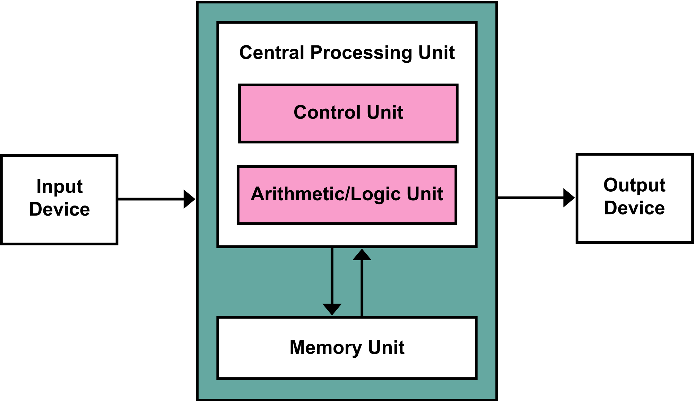
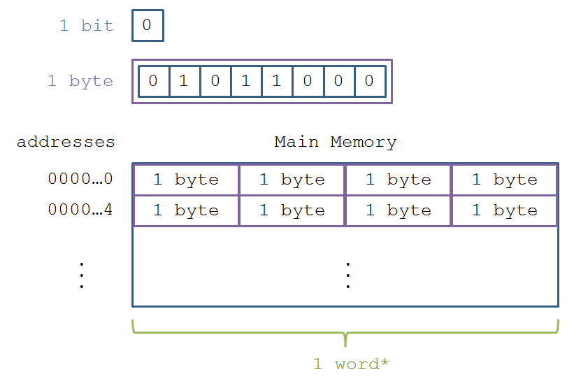
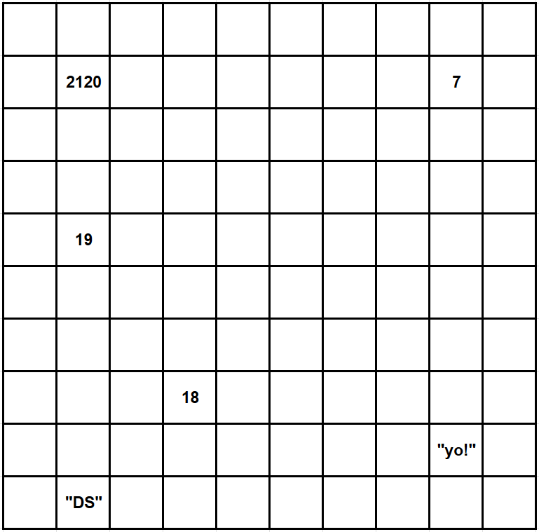
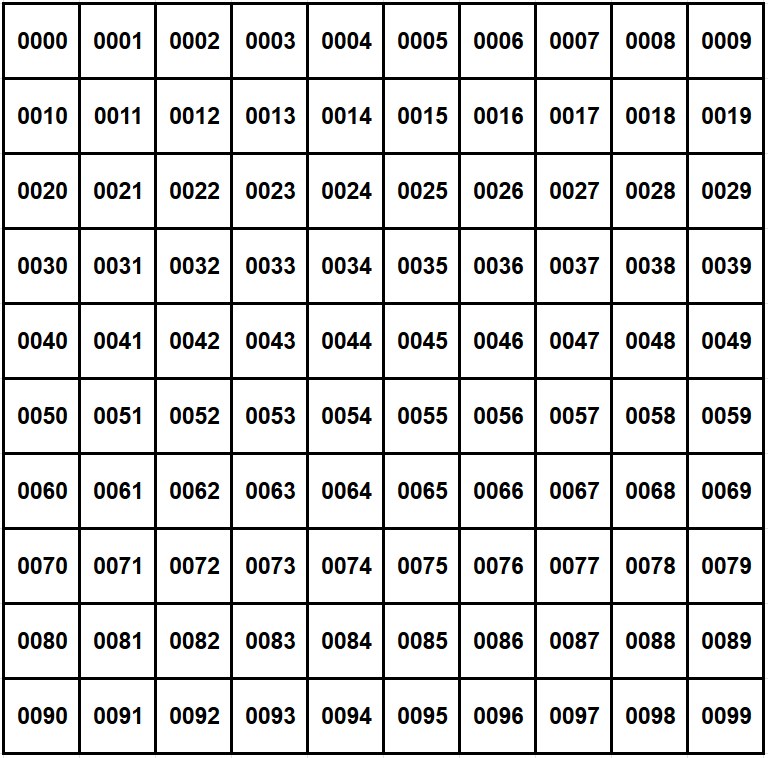
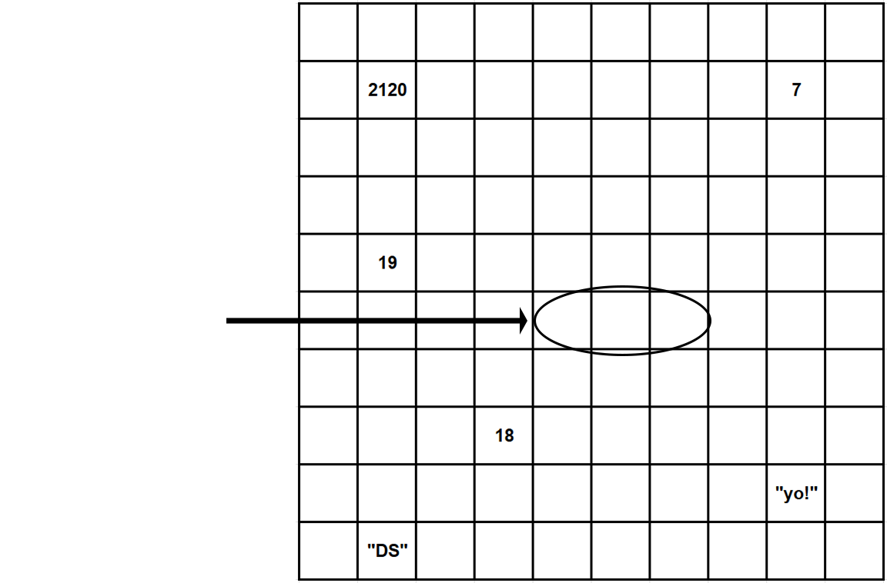
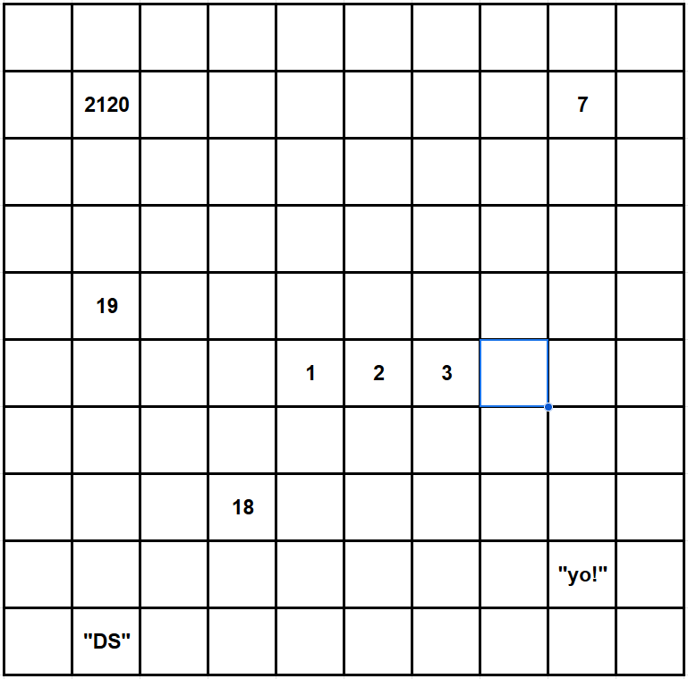
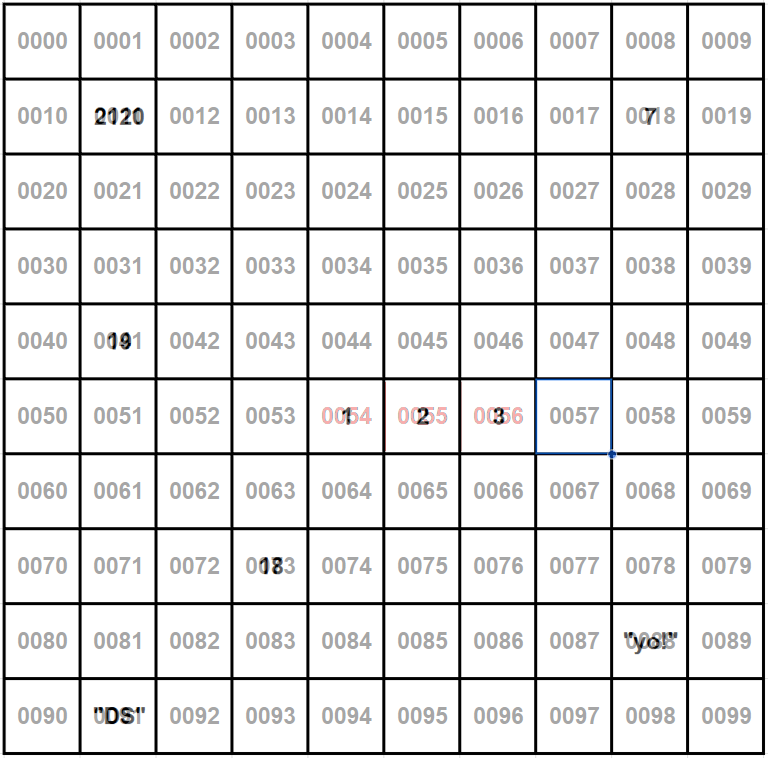

# Lecture 5: Remember Memory
=============================

**Architecture**
================
The vast majority of computers in the modern era operate under a typical format: 

    - This format is known as the Von Nuemann Architecture, which describes he basic format of computer hardware and how they interact.
The Von Nuemann Architecture has three main components:

**1: The CPU**
==============
The CPU is commonly known as the "brains" of the computer, and is responsible for fetching, decoding, and then executing machine instructions.

The CPU consists of several sub-components, like the Arithmetic Logic Unit (ALU), which is responsible for processing common mathmatical operations.

The Control Unit (CU) is responsible for directing instructions into this fetch-decode-execute cycle, and manages the CPU's interactions with memory and I/O devices.

**2: Main Memory**
Also known as RAM, Main Memory constitutes the computer's short term memory, and is used for storing temporary information for quick access.

**3: Input/Output Devices**
I/O devices are basically everything else! Input devices are thinks like keyboard, mice, microphonesm and camerasm and output devices includes monitors and audio devices.

As our computer is operating, the processor is almost constantly fetching instructions to execute as given by our programs and operating system.

Intermediary computational data are stored in the main memory (RAM), which we'll now examine more closely

**Main Memory**
===============
Main Memory is used to hold running machine code and any data used by the program (the call stack, variables, objects, and much more!)

**Bits**
Digital information is stored, at its smallest constituent level, in bits:
magnetic low and high, represented by 1 and 0

Bits are strung together to store more information. There are 8 bits in one ***byte**
-----------------------
Main memory consusts of large "banks" of bytes organized to be able to store and retrieve information quickly.
These banks consist of contiguous blocks of bytes organized in a sequential addressing system.
Different computers will gave different byte-grouping styles depending on its hardware.

**Words & Word-Size**
`A word is an architecture-dependent number of bytes that represents the maximum number of bits that it can process at one time.`

The word-size is the number of bytes in one word per system
    ex: a 64-bit system has 8 bytes in one word: the 64-bit architecture can process 64 bits at once.

The word size is limited by the hardware and operating system of a computer.

Main Memory is indexed by `Memory Address`, which are numerical orderings of the words in the RAM.

Typically, addresses are 1 byte apart, with a maxumum address decided by the computer architecture

`For example:` if our addresses start at `0x0000` (ie.,0) then `0x004` (i.e, 4) would be the address 4 bytes away.

^ Recall that word-size is architecture dependant. The image depicts a 32-bit architecture.

**Allocation Basics**
=====================
How does Python interact with memory? For this discussion, we'll focus on how variables are stored.
`Variables of any type reserve an appropriate amount of memory in which to store their data. Memory reserved for one variable cannot be used for another until that memory has been freed.`
This is true of primitives, whose sizes are always known (e.g, integers take up 32 bits), as well as objects, who's size can vary.

Let's take a look at another set of diagrams.
Below is an example of a collection of memory cells, displayed as a grid. In the diagram, you'll see that some are empty, and others contain data.

`Each cell in this diagram is a point in your computer's memory, and each has a memory address:`


Any of these addresses can be accessed at virtually instantaneous speed, presuming you know which address you want to access.

```python
    x: tuple[int, int, int] = (1, 2, 3)
```
`A tuple is an ordered collection of elements, similar to a list, but with the key distinction that it is immutable, meaning once created, its contents cannot be changed`

When a program declares a tuple, it allocates a contiguous set of empty cells for use in the program. So, if you were creating a tuple meant to hold three elements, your computer would find any group of three empty cells in a row, and designate it to serve as your tuple.

`After this designation, it assigns each integer in the tuple to a cell in the memory`


`So now, we have a tuple with the values (1, 2, 3), stored in memory. But how do we access it?`


With their memory addresses! In general, a variable for a tuple will point to the memory location where the tuple `begins`. So our variable x is a memory pointer ro the memory location 0054.

Let's take a look at the below example
```python
x: tuple[int, int, int] = (1, 2, 3)
print(x[2])
```
What happens when we try to access x[2]?
1. Our tuple begins at index 0 with memory address 0054
2. Index 2 will be exactly 2 cells past index 0
3. So to find index 3, we'd  go to the memory address 0056.
Once the computer jumps to the memory address 0056, it returns the value, which is 3.