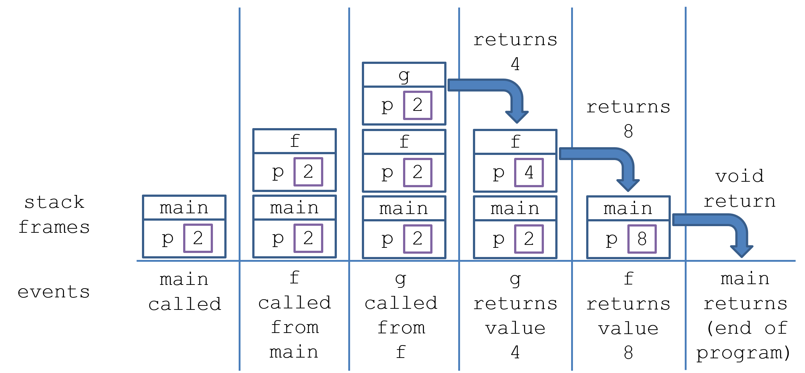

# Lecture 5: Remember Memory
=============================

**Architecture**
================
The vast majority of computers in the modern era operate under a typical format: 

    - This format is known as the Von Nuemann Architecture, which describes he basic format of computer hardware and how they interact.
The Von Nuemann Architecture has three main components:

**1: The CPU**
==============
The CPU is commonly known as the "brains" of the computer, and is responsible for fetching, decoding, and then executing machine instructions.

The CPU consists of several sub-components, like the Arithmetic Logic Unit (ALU), which is responsible for processing common mathmatical operations.

The Control Unit (CU) is responsible for directing instructions into this fetch-decode-execute cycle, and manages the CPU's interactions with memory and I/O devices.

**2: Main Memory**
Also known as RAM, Main Memory constitutes the computer's short term memory, and is used for storing temporary information for quick access.

**3: Input/Output Devices**
I/O devices are basically everything else! Input devices are thinks like keyboard, mice, microphonesm and camerasm and output devices includes monitors and audio devices.

As our computer is operating, the processor is almost constantly fetching instructions to execute as given by our programs and operating system.

Intermediary computational data are stored in the main memory (RAM), which we'll now examine more closely

**Main Memory**
===============
Main Memory is used to hold running machine code and any data used by the program (the call stack, variables, objects, and much more!)

**Bits**
Digital information is stored, at its smallest constituent level, in bits:
magnetic low and high, represented by 1 and 0

Bits are strung together to store more information. There are 8 bits in one ***byte**
-----------------------
Main memory consusts of large "banks" of bytes organized to be able to store and retrieve information quickly.
These banks consist of contiguous blocks of bytes organized in a sequential addressing system.
Different computers will gave different byte-grouping styles depending on its hardware.

**Words & Word-Size**
=====================
`A word is an architecture-dependent number of bytes that represents the maximum number of bits that it can process at one time.`

The word-size is the number of bytes in one word per system
    ex: a 64-bit system has 8 bytes in one word: the 64-bit architecture can process 64 bits at once.

The word size is limited by the hardware and operating system of a computer.

Main Memory is indexed by `Memory Address`, which are numerical orderings of the words in the RAM.

Typically, addresses are 1 byte apart, with a maxumum address decided by the computer architecture

`For example:` if our addresses start at `0x0000` (ie.,0) then `0x004` (i.e, 4) would be the address 4 bytes away.

^ Recall that word-size is architecture dependant. The image depicts a 32-bit architecture.

**Allocation Basics**
=====================
How does Python interact with memory? For this discussion, we'll focus on how variables are stored.
`Variables of any type reserve an appropriate amount of memory in which to store their data. Memory reserved for one variable cannot be used for another until that memory has been freed.`
This is true of primitives, whose sizes are always known (e.g, integers take up 32 bits), as well as objects, who's size can vary.

Let's take a look at another set of diagrams.
Below is an example of a collection of memory cells, displayed as a grid. In the diagram, you'll see that some are empty, and others contain data.

`Each cell in this diagram is a point in your computer's memory, and each has a memory address:`


Any of these addresses can be accessed at virtually instantaneous speed, presuming you know which address you want to access.

```python
    x: tuple[int, int, int] = (1, 2, 3)
```
`A tuple is an ordered collection of elements, similar to a list, but with the key distinction that it is immutable, meaning once created, its contents cannot be changed`

When a program declares a tuple, it allocates a contiguous set of empty cells for use in the program. So, if you were creating a tuple meant to hold three elements, your computer would find any group of three empty cells in a row, and designate it to serve as your tuple.

`After this designation, it assigns each integer in the tuple to a cell in the memory`


`So now, we have a tuple with the values (1, 2, 3), stored in memory. But how do we access it?`


With their memory addresses! In general, a variable for a tuple will point to the memory location where the tuple `begins`. So our variable x is a memory pointer ro the memory location 0054.

Let's take a look at the below example
```python
x: tuple[int, int, int] = (1, 2, 3)
print(x[2])
```
What happens when we try to access x[2]?
1. Our tuple begins at index 0 with memory address 0054
2. Index 2 will be exactly 2 cells past index 0
3. So to find index 3, we'd  go to the memory address 0056.
Once the computer jumps to the memory address 0056, it returns the value, which is 3.

**Garbage Collection**
======================
Since memory is finite, we want a way to free memory that is no longer being used  
`Garbage collection is the process by which memory reserved for garbage (i.e., variables and objects that are never going to be used again in our code) is freed.`  

Python has a garbage collector, unlike C/C++  

To understand the Python garbage collector, we need to understand a bit about he lifespan of variables. 
***What is a Local Variable?:***
    *Local Variables exist only in their defined scope. When a programs control flow leaves that scope (e.g. returning from a function) the memory allocayed for those local variables is freed.*

`Garbage collection for local variables is quite simple: allocate the memory when declared, keep it as long as it is in scope, then deallocate when it is out of scope.`

For this reason, local variables are allocated in a special area of memory called `the stack` (since we push and pop scopes from the stack as well as each scope's associated local variables). Essentially, each time a new scope (like a function or a loop) is entered, the local variables for that scope are pushed onto the stack. When the scope ends, those variables are popped off, freeing up the memory.

**Stacks**
==========

The `Call Stack` determines what values of which variables are stored in which `Stack Frames`, containing all of the local variables belonding to a particular function call.

A `Stack Frame` is a section of the stack that holds information about a single function or method call. 
    - When a function is called, a new stack frame is created and pushed onto the stack. When the function finishes, its stack frame is popped off, and execution continues from the return address. This process is critical for managing function calls and local variable lifetimes in a program.
***Example***
```python
def g(p: int) -> int:
    return p + 2

def f(p: int) -> int:
    p = g(p)
    return p * 2

p: int = 2
p = f(p)
print (p)
```


***Notes on the above:***
    - Although each parameter of f, g have the same name p, they each reserve their own memory for it in their respective stack frames.
    -Each time a method is called, it generates a new stack frame atop the one that called it; this is how we know where to return control flow after a method returns.
    -When a method returns, whatever local variables were allocated to it in its stack frame (which includes parameters) are also freed.

**Heaps**
=========
Local variables are great for storing small pieces of data like counters or flags. But when we need to store larger data (like big objects), it becomes a problem. Allocating memory for large objects can take up a lot of resources, so we want to avoid doing it too often.

To handle this, we use heap allocation and references:

In Python, large objects are stored in a part of memory called the heap. The heap is just a special area of memory where objects go when they need more space than a local variable can offer.

Each object in the heap is accessed using a reference, which is simply a memory address pointing to where the object is located.

So, when you create an object, memory is allocated for that object in the heap, and the variable you use to hold it stores the reference (the memory address) to that object, not the object itself.

***Example***
```python
locVar: int = 5
heapVar: Classy = Classy()
```


***Things to note about the above:***
    - The locVar local int is stored directly in the stack. It will remain there until it is popped from the stack 
        (i.e., falls permanently out of scope).
    - The Classy object (i.e., any non-primitive) is stored in the heap, but its `reference` is stored in the stack and is called heapVar.
    - The Classy object will remain in the heap until no references point to it. The local reference heapVar will stay in the stack until it is popped.

**Deallocation in Python**
==========================
When an object is created in python, the compiler also creates a reference count for it. This increments for each new reference.
***example:***
The list below wpild have a reference count of 2.
```python
a: list = [1, 2, 3]
b: list = a
```

When an object is dereferenced, (like doing this: a = None), the reference count is decremented. Once the reference count is 0, the memory for the object is garbage collected.

**Reference Mechanics**
=======================
Referencing can get a bit overwhelming if not diagramed.
`Object references can be set and compared to None, eg, b: Burnymon = None and if b == None:.`
`If we create a variable and don't assign it, then if we try to access it we'll get a NameError.
```python
b: Burnymon
b.get_health()
# NameError: name 'b' is not defined
```
**Reference Assignment**
========================
`References can be copied just by using the assignment operator (=), which also happens when references are passed as arguments to functions (the parameters are assigned the same references as the argument).`
This has the effect of simply storing the memory location of the object in the heap within multiple local reference variables; pictorially, we have:
```python
    burny: Burnymon = Burnymon("Dave")
    burny2: Burnymon = burny
```


Things to Note:
    -burny and burny2 are both references that point to the same Burnymon object in memory. This means that if I call burny.take_damage(...);, that damage taken will be manifest if I were to call burny2.get_health();
    -Importantly, assigning one reference to another does not make a copy of that object.
    -The Burnymon object in the heap will only be deallocated when BOTH burny and burny2 references are deallocated.
    - Note: when we draw the above, and we see that burny and burny2 point to the same object in the heap, then we know that burny is burny2 => true! This is how we can think about the identity equivalence check described in the last lecture, which can be answered visually: if two references point to the same object in memory, they would be identity equivalent.

Heap Allocation with references is useful for a variety of reasons:
    -We can decide the lifetime of an object, rather than have it necessarily be deallocated when popped from the stack.
    -This allows us to also pass the same object between methods so that its state can be modified by them needing to only reference the parameter.

**Passing Assignments**
=======================
When arguments are sent to functions, a new reference to the object is being sent to the function: but the parameter in the function is fundamentally still a reference to the same object, although a new variable is created in the parameters that refer to it.
***example***
```python
def add_number(x: list, y: int) -> None:
    x.append(y)

new_list = [1, 2, 3]
add_number(new_list, 4)
print(new_list)
```
While a new variable x was made in add_number, it fundamentally refers to the same object in memory. This kind of behavior is important to remember if you want to pass an object into a method or function but you don't want the edits within the function to affect the original object. To do this we make a deep copy, which we'll cover later.

**A Note on Immutable Types**
=============================
While integers, strings, and tuples are still passed by assignment/reference, their immutability prevents them from being able to be affected like mutable objects.