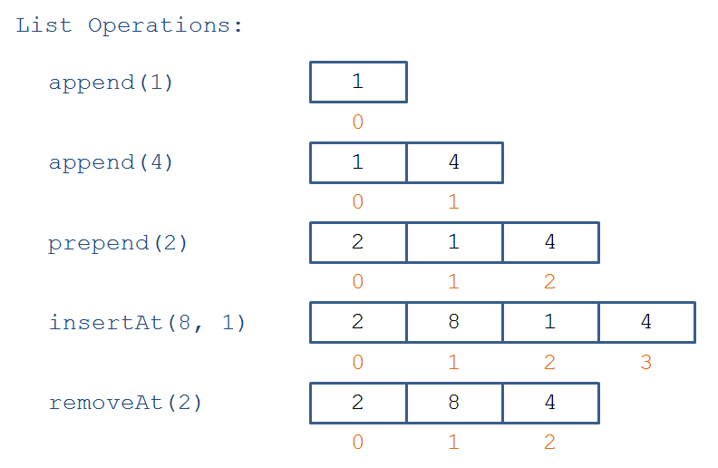
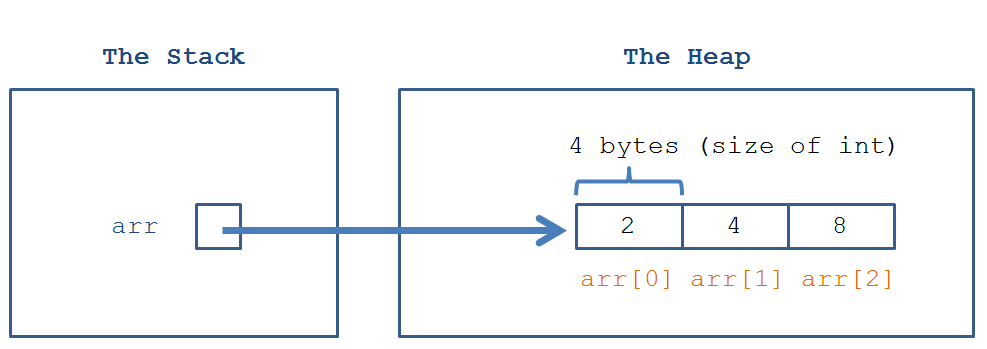
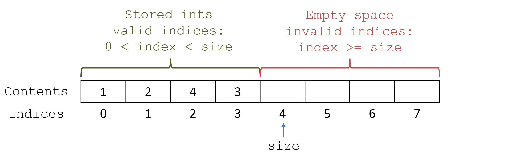

# Lecture 6: Enlisted to List
=============================

**Array Lists - Overview**
===========================
`What is a "data type" (sometimes called an Abstract Data Type [ADT]) and how is it different from a "Data Structure" [DS]?`
`Data Type` defines the kind of data a variable can hold, `such as integers, floats, strings, or booleans`. It specifies the operations that can be performed on that data, like arithmetic operations on numbers or concatenation on strings. Data types help to ensure that values are used correctly in a program, limiting what can be done with them based on their type. For example, an integer can hold whole numbers, while a string holds sequences of characters, and a boolean holds true or false values.

`Data Structure` refers to the way data is organized, stored, and managed to perform operations efficiently. A data structure allows for grouping multiple data types together and helps in organizing the data to support operations like searching, inserting, or deleting elements. `Examples of data structures include arrays, linked lists, stacks, queues, trees, and graphs.` While data types focus on the nature of a single value, data structures focus on how multiple values are arranged and accessed.

**Lists**
=========
A `List` is an ADT (Abstract Data Type) in which data is stored in an ordered sequence, and duplicate values in the collection are allowed
An `Array List` is a data stucture implementing the list ADT such that elements maintain a relative order to one another and are indexed + stored like `arrays`
A `Collection` is a data structure responsible for holding some number of data elements in a particular fashion.
    - A `List` is an Abstract Data Type that is also a Collection, and an `Array List` is a List.

In general, most data collections support several basic types of actions (of which there can be multiple formats):
    - Insertion: Add an element into the collection
    - Deletion: remove an element from the collection
    - Retrieval: return an element at a given position in the collection / ask if an element is within the collection

 Array Lists are one such structure; let's look at some of the supported operations:

Some things to note about the above:
-The list can be of variable size to accommodate any number of inserted entries.
-The items are arranged relative to one another. Note that insertAt(8, 1) placed an 8 at index 1 and then shifted all of the other elements to the right.

**A Look at Arrays**
====================
```C
int arr[] = {2, 4, 8}
```
This is an `Array`. Arrays are an ordered collection of data for elements of the same type.
Like all other objects, they posses a reference that stores their elements in a heap.


When we declare our array, we reserve exactly as much space as is required for three integers, and then populate that memory with the initialized values.

Arrays are `mutable`, meaning that we can change the value of what is stored at any of the indices,
```C
int arr[] = {2, 4, 8};
arr[2] = 16

# The array is now [2, 4, 16]
```

The way Arrays work comes with a number of advantages and limitations in terms of memory:
**Advantage 1**
`Elements in arrays are easy to quickly access, as they are stored as continuous indexes in memory. Any element within the array can be accessed in one step.`

**Advantage 2**
`Arrays use memory very efficiently: they reserve only the memory required to store the elements within them!`

**Limitation 1**
`Arrays are fixed length, meaning that they do not change their allocated memory once it is reserved.`
    Why can't we change the length of an Array once created?
        -Arrays allocate a specific, fixed amount of memory for their elements: if we wanted to add more elements, we'd likely be interrupted by a cell of memory that's already been allocated to something else!

We can also create an array using dynamic allocation by specifying how many elements will be in it, but not specifying what values those elements are. The below code creates an empty array with three integers: it will reserve an appropriate amount of space in memory for 3 integers.
```C
int arr[] = int[size]
```
Why `dynamic allocation?` Dynamic because we can request memory allocated for an array of whatever size we want (memory allowing) at runtime, rather than needing to know its fixed size at compilation time (in other words, size above can be a variable).

However, this is only one part of the solution that we'll need to finally implement an array list... because what we allocate here will still be fixed-size.

**Limitation 2**
`Arrays do not support arbitrary index insertion/deletion while preserving relative order of the items.`
For instance if I have an array like int[] arr = {1, 2, 3} and I want to insert 8 at index 1, I cannot simply say arr[1] = 8, because this statement will overwrite the 2 at index 1, rather that shift it and the 3 to the right as we did using insertAt above.

**Limitation 3**
`Arrays do not support heterogenous types within them: to declare them, you need to know exactly what types are in the array in order to allocate proper memory to them, so all elements need to be of the same type to maintain continuity.`
So what can we see here? Arrays are similar to Lists in concept (an ordered collection of elements), but possess a number of limitations due to how they interact with memory that do not permit them the flexibility of a List.


**The Solution?**
`Create a custom class to delegate dynamic sizing and arbitrary insertion/delection!`


The bottom line: arrays are almost supportive of the list expected interface, but have some shortcomings.
Thus, we have to find a way to model the list behavior while overcoming the shortcomings of arrays.

**Insight 1**
`We can store our values internally as a primitive array, that should always have space for more values than are currently in the list, but never less`

**Insight 2**
`We'll also want to keep track of the number of values we have stored in our array, so we'll have a tracking field for the !size! as well`

**Insight 3**
`The !size! field serbes another purpose: it indicates which elemenents in our array are "valid" and thus contain the elements we'd like it to, and which are "invalid" and therefore should be inaccessable to the user`

Organizationally, our fields should look like the following:


**The PyArray Class**
=====================
```python
from typing import Any, Union

class PyArray:
    def __init__(self, arr_type: type, argument: Union[list, int]) -> None:
        self.__length: int = 0
        self.__elements: list = []
        self.__arr_type: type = arr_type
        if(isinstance(argument, int)):
            self.__length = argument
            for i in range(self.__length):
                self.__elements.append(None)
        elif(isinstance(argument, list)):
            for item in argument:
                if not isinstance(item, self.__arr_type):
                    raise ValueError(f"Incompatible types: All values in argument must be of type {self.__arr_type}. Recieved type {type(item)} instead.")
            self.__elements = argument.copy() 
            self.__length = len(argument)
        else:
            raise ValueError(f"Incompatible types: All argument must be of type {list} or {int}. Recieved {type(argument)} insttead.")

    def __str__(self) -> str:
        return str(self.__elements)
    
    def __getitem__(self, key: Union[slice, int]) -> Any:
        if(isinstance(key, slice)):
            start, stop, step = key.indices(self.__length)
            return PyArray(self.__arr_type, [self.__elements[i] for i in range(start, stop, step)])
        elif(isinstance(key, int)):
            return self.__elements[key]
        else:
            raise ValueError(f"Incompatible types: key must be of type  {type(int)} or {type(slice)}. Recieved type {type(key)} instead.")
    
    def __setitem__(self, key: int, new_value: Any) -> None:
        if isinstance(new_value, self.__arr_type) or new_value is None:
            self.__elements[key] = new_value  
        else: 
            raise ValueError(f"Incompatible types: new_value must be of type {self.__arr_type}. Recieved {type(new_value)} instead.")
    
    def __len__(self) -> int:
        return self.__length
```
**Read Lecture 6 PyArray Syntax**
https://publish.obsidian.md/saad/Lecture+Notes/Lecture+6#PyArray%20Syntax

**Array Lists - Implementation**
================================
`Design an implementation of the array list ADT that supports dynamic sizing (arbitrary length) and relative item ordering for ints. Call this the IntArrayList class.`
```python
from py_array import PyArray

class IntArrayList:
	def __init__(self) -> None:
		raise NotImplementedError

	def get_at(self, index: int) -> int:
		raise NotImplementedError

	def append(self, to_add: int) -> None:
		raise NotImplementedError

	def insert_at(self, to_add: int, index: int) -> None:
		raise NotImplementedError

	def remove_at(self, index: int) -> None:
		raise NotImplementedError
```