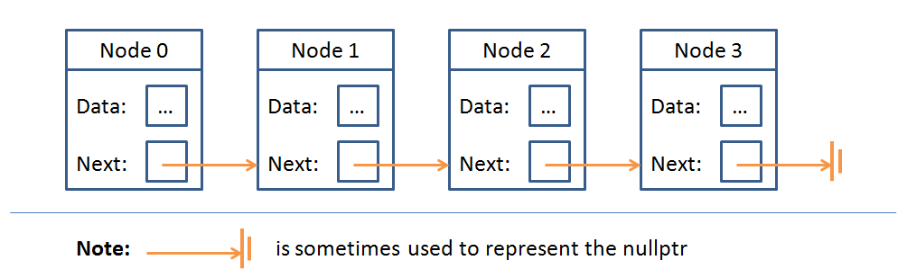
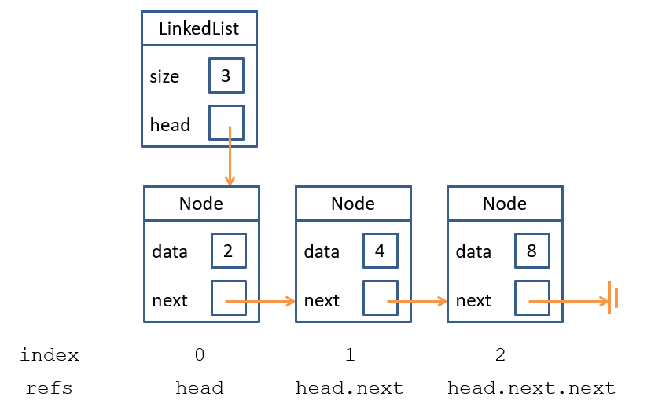

# Lecture 7 LINKED LISTS!!
===========================
A `Linked List` is an implementation of the List ADT except that instead of arrays storing the position of each list element, the relative order of data is stored through `data nodes` with  `references` that point to next/previous nodes in the sequence.
    - A `linked list node` is an object used to enclose the data being stored, as well as references to the next node in the chain (in the case of a singly linked list), or references to both the next and previous node in the chain (in the case of doubly linked lists).

(where nullptr is just an abbreviation of no reference, which is simply a reference that has been assigned the value None)

`Note: Just like the contents of any sequential list index, the data field of any node can contain data (or references to data) of any type (even another linked list)`

**Inside Linked Lists**
=======================

**Nodes**

The `Data` Field
----------------
`data` contains the "meat" of the LinkedList, the information you want to store as an element.

The `Next` field
----------------
`next` simple contains a reference to another Node -> a pointer directing you to the next element's position in memory. This field can also contain `None`, signalling that this is the final node in the list.
    `-Note: There are also implementations of linked lists where None is never used; for instance, circular linked lists simply connect the last Node to the first, and can check if any Node is the final by seeing if its next is the same as the first`

**The Structure**
`The linked sequence of nodes are the internal storage mechanism for a Linked List, similar to how we store items in an Array List using an array (behind the scenes)`

There are two seperate classes to be designed:
1: `The Linked List Nodes`: As depicted above with stored data and references to other Nodes in the sequence.
2: `The Linked List Itself`: Keeps track of the Nodes internally, has a public interface, etc

Some Linked List Fields
------------------
`size` of the Linked List, tracking how many elements are stored within.
`head` reference to the first Node in the Linked List.
`tail` reference to the last Node in the Linked List.

**Linked List Operations**
==========================
Inserting a new item into a LinkedList generally follows a 3-step process:
    -Create a new node containing the data to add
    -(Sometimes) Find where that node should go in the sequence
    -Repair necessary references (both of surrounding Nodes and possibly the LinkedList's head/tail) so that the relative order of items is respected
In other words, inserting into LinkedLists is quite simple `when we know where we want to insert the new Node.`